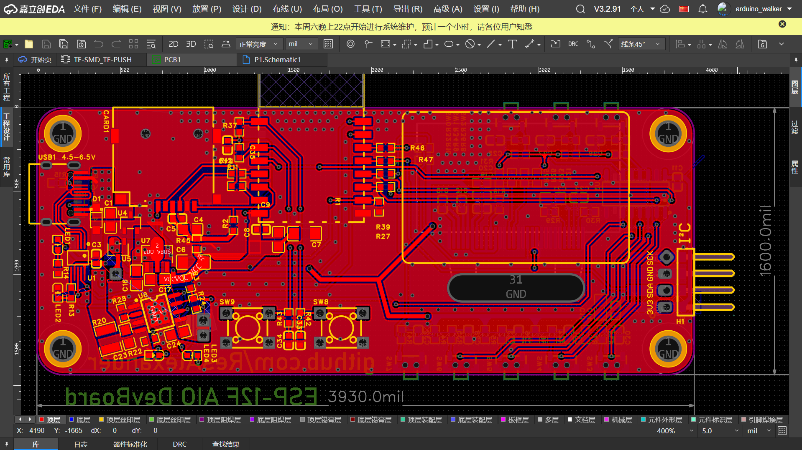
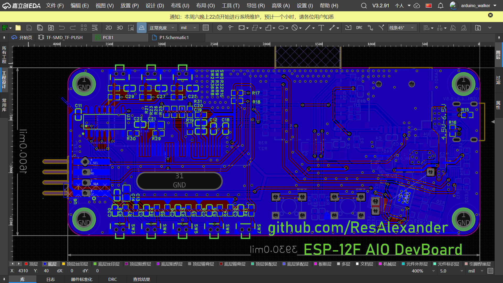

# \[WIP Work In Progress 未完成] ESP-12F_AIO_DevBoard

## \@brief
An ESP-12F (ESP8266MOD) All-in-One DevBoard.
Onboard: 504080 Li-po Battery, 1.3" SH1106 I2C Display, DHT20 Sensor, 20MHz SD-SPI Interface, 7 Buttons (via 74HC165).
Exposed I2C Header for seamless expansion.

ESP-12F (ESP8266MOD) All-in-One 开发板
板载：504080锂聚合物电池，1.3寸SH1106显示屏，DHT20温湿度传感器，20MHz SD SPI，7个通过74HC165驱动的按钮
外拓了IIC

## \@changelog

### 2026-03-21
将ESP-12F上移，确保RF性能仍然较为良好，而不用被两边的gnd挤压。drc基本没问题，先改到这。

### 2026-03-11 （补充于2026-03-11）
差不多完成？
f'f

